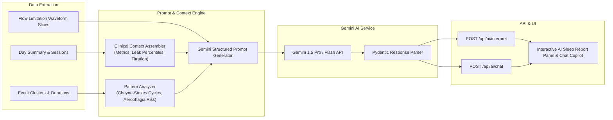

# Oscarius System Architecture & Design Document

A modern, web-based sleep therapy and CPAP data analysis platform with native AI clinical interpretation capabilities, built as a zero-dependency web replacement for OSCAR (Open-Source CPAP Analysis Reporter).

---

## 1. Executive Summary & Vision

### The Problem
Patients diagnosed with obstructive, central, or complex sleep apnea rely on positive airway pressure (CPAP, APAP, BiPAP/ASV) therapy. Traditional desktop software like OSCAR (built with C++ and Qt6) offers unmatched clinical depth but suffers from significant limitations:
- **Desktop Friction**: Requires local C++ desktop compilation, complex Qt dependencies, and platform-specific installers.
- **No Native Web Access**: Cannot be accessed seamlessly from mobile devices, tablets, or remote browsers without cumbersome remote desktops.
- **Lack of Intelligent Interpretation**: Raw time-series data and discrete event flags (Obstructive Apneas, Central Apneas, Hypopneas, Flow Limitations) overwhelm non-specialist users without clinical context.

### The Solution: Oscarius
Oscarius re-architects the OSCAR ecosystem into a modern, decoupled web platform:
1. **Decoupled Architecture**: High-performance Python backend paired with an interactive, responsive React/TypeScript frontend.
2. **Full Compatibility**: 100% binary and schema compatibility with standard OSCAR SQLite databases (Schemas v12 through v18) and native Qt `qCompress` waveform BLOBs.
3. **Pure-Python Hardware Ingestion**: Ingests raw ResMed SD cards directly using a pure-Python EDF/EDF+ parser without external binary dependencies.
4. **Interactive High-Precision Visualizer**: Multi-track HTML5 Canvas rendering capable of smooth 60 FPS panning, zooming, and crosshair inspection across 700k+ waveform data points.
5. **AI Clinical Copilot (Phase 3)**: Deep integration with Gemini models to provide actionable, clinical-grade interpretation of sleep therapy, mask leaks, pressure titration, and event clustering.

---

## 2. System Architecture

Oscarius follows a layered, modular architecture separating physical data ingestion, storage, signal processing, API delivery, and presentation.

```mermaid
graph TD
    subgraph Ingestion ["Hardware & Data Ingestion"]
        SD["ResMed SD Card<br/>(Identification.json, STR.edf, DATALOG/*.edf)"]
        OSCAR_DB["Existing OSCAR DB<br/>(oscar.db v12-v18)"]
        EDF["Pure-Python EDF / EDF+ Parser<br/>(Physical Scaling & TAL Events)"]
        Importer["ResMed Importer & Schema Creator<br/>(Waveform qCompress Encoder)"]
        SD --> EDF
        EDF --> Importer
    end

    subgraph Storage ["Storage Layer (SQLite)"]
        DB[("OSCAR SQLite DB<br/>Profiles, Sessions, Summaries,<br/>event_lists, event_data (BLOB)")]
        Importer --> DB
        OSCAR_DB --> DB
    end

    subgraph Core ["Processing & Signal Engine"]
        Decoder["Waveform BLOB Decoder<br/>(Qt qCompress / zlib int16)"]
        LTTB["LTTB Downsampling Engine<br/>(Largest-Triangle-Three-Buckets)"]
        Summaries["Clinical Aggregations<br/>(Noon-to-Noon Day, AHI, Compliance)"]
        DB --> Decoder
        Decoder --> LTTB
        DB --> Summaries
    end

    subgraph Backend ["FastAPI Backend & CLI"]
        API["FastAPI REST Endpoints<br/>/api/profiles, /days, /events, /waveform"]
        Static["Static SPA Host<br/>(/ and /assets)"]
        CLI["Oscarius CLI<br/>oscarius import | oscarius serve"]
        LTTB --> API
        Summaries --> API
        API --> Static
    end

    subgraph Frontend ["Web Frontend (React / TS / Vite)"]
        Scorecard["Clinical Scorecard<br/>(Usage, Compliance, AHI, Percentiles)"]
        Viewer["Multi-Track Canvas Viewer<br/>(Flow, Pressure, Leak, Crosshairs)"]
        Events["Events Log & Click-to-Inspect"]
        Nav["Date & Profile Navigation"]
        Static --> Frontend
        API <--> Frontend
    end

    subgraph AI ["AI Clinical Engine (Phase 3)"]
        Context["Context Extractor<br/>(Nightly Metrics & Event Clusters)"]
        Gemini["Gemini Clinical Copilot<br/>(Narrative Summaries & Analysis)"]
        DB --> Context
        Context --> Gemini
        Gemini --> API
    end
```

---

## 3. Core Subsystems & Technical Decisions

### 3.1 Storage Layer & OSCAR Compatibility
- **Schema Parity**: Compatible with OSCAR SQLite schema versions 12 through 18. Auto-provisions Schema v18 DDL and default CPAP channels when creating a new database from scratch.
- **Waveform Compression (`qCompress`)**: OSCAR stores raw int16 signal streams in `event_data.data_blob` using Qt's `qCompress` format. This consists of a 4-byte big-endian unsigned integer (specifying uncompressed byte length) followed by raw zlib-compressed bytes. Oscarius provides verified bidirectional decoding and encoding (`qcompress_decode` and `encode_qcompress`).
- **SQLite Concurrency**: FastAPI runs database I/O within worker threads managed by AnyIO. Oscarius enforces `check_same_thread=False` and uses row-factory mappings for thread-safe access.

### 3.2 Pure-Python EDF / EDF+ Ingestion Engine
- **Zero C-Dependencies**: Unlike libraries requiring native C compilation (`pyedflib`, `EDFLib`), Oscarius implements a 100% pure-Python binary parser (`oscarius.importers.edf.EDFReader`).
- **Physical Calibration**: Signals are converted from 16-bit raw signed integers using linear calibration:
  $$\text{value} = \text{raw} \times \text{gain} + \text{offset}$$
  where:
  $$\text{gain} = \frac{\text{PhysMax} - \text{PhysMin}}{\text{DigMax} - \text{DigMin}}, \quad \text{offset} = \text{PhysMin} - (\text{DigMin} \times \text{gain})$$
- **TAL Annotation Parser**: Decodes EDF+ Time-stamped Annotation Lists (`TAL`) to extract discrete timestamps, durations, and text descriptions for respiratory events (Obstructive Apneas, Central Apneas, Hypopneas).
- **ResMed Structure Support**:
  - `Identification.json` (AirSense 11) and `Identification.tgt` (AirSense 10 & S9) for machine model and serial number discovery.
  - `DATALOG/*_BRP.edf`: 25 Hz Flow Rate signal (`0x1000`).
  - `DATALOG/*_PLD.edf`: 1 Hz Mask Pressure (`0x1001`), Leak Rate (`0x1002`), Tidal Volume, Minute Vent, etc.
  - `DATALOG/*_EVE.edf`: Discrete respiratory event markers.

### 3.3 Signal Processing & LTTB Decimation
A typical 8-hour CPAP session records over 720,000 samples at 25 Hz for Flow Rate alone. Sending raw arrays over HTTP causes severe browser memory overhead and rendering latency.
- **LTTB (Largest-Triangle-Three-Buckets)**: Oscarius applies the LTTB decimation algorithm (`oscarius.signal.lttb.downsample_lttb`), reducing 700k+ points to 1,000–2,000 screen-resolution points in milliseconds.
- **Feature Preservation**: Unlike naive min-max or average bucketing, LTTB preserves critical diagnostic features (peaks, valleys, inspiratory flattening, and flow limitation shapes).
- **Viewport Windowing**: `window_and_downsample` applies binary-search window slicing (`start_ms`, `end_ms`) before decimation, dynamically scaling resolution as the user zooms in.

### 3.4 Temporal Invariant: The "OSCAR Day"
Sleep therapy sessions frequently cross midnight. To prevent fragmented reporting:
- A therapy day is defined from **12:00 PM (Noon) to 12:00 PM the following day**.
- Any session starting at 11:30 PM on Sept 4 or 2:00 AM on Sept 5 belongs to the **Sept 4** therapy day.
- Implemented in `calculate_oscar_day(timestamp_ms)`.

### 3.5 High-Performance Web Frontend
- **Framework**: React 19 + TypeScript bundled with Vite.
- **Direct Canvas 2D Rendering**: Rather than bloated DOM-based SVG chart libraries that choke on high-frequency time-series, Oscarius uses direct HTML5 Canvas 2D rendering.
- **Synchronized Multi-Track Engine**:
  - Track 1: Flow Rate ($\pm 60 \text{ L/min}$) with zero baseline and semi-transparent colored event tags (`OA`, `CA`, `H`).
  - Track 2: Mask Pressure ($4 - 20 \text{ cmH}_2\text{O}$).
  - Track 3: Leak Rate ($0 - 40 \text{ L/min}$) with clinical $24 \text{ L/min}$ redline threshold.
- **Micro-Interactions**:
  - Centered mouse wheel zooming.
  - Horizontal drag-to-pan.
  - Minimap overview timeline with live viewport highlight.
  - Synchronized hover crosshairs with live physical unit readouts across all tracks simultaneously.
- **Click-to-Inspect**: Clicking any event in the events log immediately centers and zooms the waveform viewer on that event with a 30-second context window.
- **Design System**: Tailored clinical dark palette (slate/navy `#0b0f17`, sky blue flow `#38bdf8`, emerald pressure `#34d399`, amber leak `#fbbf24`), Google Fonts (Inter + JetBrains Mono), adhering to strict non-cliché UX principles.

---

## 4. Current State & Implementation Progress

### Phase 1: Core Backend & Data Ingestion (COMPLETED)
- [x] Verified SQLite connection supporting Schema v12–v18 (`oscarius.db.connection`).
- [x] Profiles and Machines domain repositories (`oscarius.db.profiles`).
- [x] Sessions, Summaries, and Noon-to-Noon day calculator (`oscarius.db.summaries`).
- [x] Waveform BLOB decompression & compression (`qcompress_decode`, `encode_qcompress`).
- [x] Respiratory event extraction and channels catalog (`oscarius.db.waveforms`).
- [x] LTTB signal decimation algorithm (`oscarius.signal.lttb`).
- [x] FastAPI REST API endpoints (`/health`, `/api/profiles`, `/days`, `/events`, `/waveform`).
- [x] Schema v18 DDL creator & clinical default channels (`oscarius.db.schema`).
- [x] Pure-Python EDF / EDF+ binary reader (`oscarius.importers.edf`).
- [x] Direct ResMed SD Card importer (`oscarius.importers.resmed`).
- [x] Unified CLI entrypoint (`oscarius serve` and `oscarius import`).

### Phase 2: Web Frontend & Waveform Visualizer (COMPLETED)
- [x] Vite + React + TypeScript scaffolding in `frontend/`.
- [x] Clinical scorecard component with AHI ratings and compliance badges (`DailyScorecard.tsx`).
- [x] Date navigator with previous/next and calendar day picker (`Header.tsx`).
- [x] High-performance synchronized 3-track Canvas visualizer (`WaveformViewer.tsx`).
- [x] Interactive minimap timeline with draggable viewport box.
- [x] Synchronized hover crosshair with instantaneous physical value badges.
- [x] Chronological events log with click-to-inspect 30-second zoom window (`EventsTable.tsx`).
- [x] Automated static bundle mounting in FastAPI (`app.mount('/', StaticFiles)`).
- [x] Development proxy configuration (`vite.config.ts`).
- [x] 100% passing tests (52 backend pytest tests, TypeScript strict build).

---

## 5. Roadmap: Phase 3 — Gemini AI Interpretation Engine (NEXT)

Phase 3 introduces automated AI interpretation of sleep therapy sessions using Gemini, transforming raw waveform metrics into actionable clinical insights.

### 5.1 Architecture Plan for Phase 3



### 5.2 Key Phase 3 Features
1. **Clinical Context Assembly**:
   - Compiles comprehensive nightly statistics: total sleep duration, AHI, OAHI, CAHI, HI, 95% leak, 95% pressure, median pressure, and session fragmentation.
   - Detects event clustering (e.g. 5 apneas in a 10-minute period following supine position shifts).
2. **Flow Limitation & Waveform Pattern Extraction**:
   - Automatically detects inspiratory flow flattening (U-shape vs sinusoidal curve) preceding obstructive events.
   - Identifies periodic breathing or crescendo-decrescendo cycles indicative of Cheyne-Stokes respiration (CSR).
3. **Structured Clinical Reports (`/api/ai/interpret`)**:
   - Generates structured narrative evaluations:
     - **Therapy Efficacy**: Is therapy controlled (AHI < 5)?
     - **Mask Leak Assessment**: Are mouth leaks or large mask leaks compromising therapy?
     - **Pressure Titration Advice**: Is the minimum pressure sufficient to eliminate flow limitation, or is the maximum pressure inducing treatment-emergent central apneas (TECSA)?
     - **Physician Discussion Points**: Bulleted questions and findings tailored for the patient's next consultation with their pulmonologist/sleep physician.
4. **Interactive Chat Copilot (`/api/ai/chat`)**:
   - Conversational interface allowing patients to ask natural-language questions:
     - *"Why was my Central Apnea count elevated on Tuesday?"*
     - *"What caused the leak spike around 3:00 AM?"*
     - *"How does my therapy this week compare to last week?"*

---

## 6. Future Roadmap: Phase 4 & Beyond

- **Multi-Vendor Ingestion**: Add pure-Python importers for Philips Respironics (DreamStation / System One), BMC Medical, and Fisher & Paykel devices.
- **Longitudinal Trend Dashboard**: Multi-week and multi-month trend charts showing AHI progression, 95% pressure drift, and compliance percentage over 30/60/90 days.
- **Cloud & Multi-Profile Support**: Optional cloud storage backend (PostgreSQL) and encrypted data synchronization for sleep clinics and telemedicine providers.
